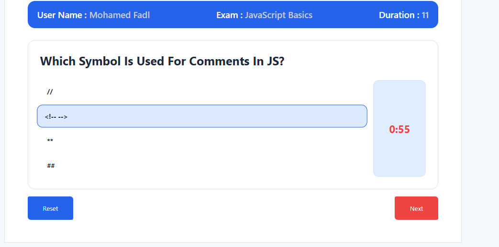
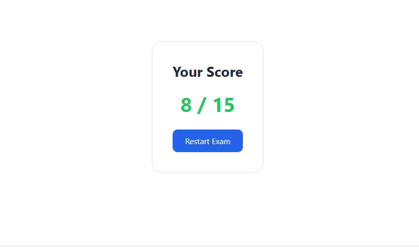

*** 1- install my website on nginx 
# Website Exam - Dockerized with Nginx

This project is a static website served using Nginx inside a Docker container.

## Tech Stack
- Nginx
- Docker
- HTML / CSS / JavaScript

## How the image was created
1. Pulled Nginx image:
2. Ran container:
   docker run -d --name website-exam -p 8080:80 nginx

3. Copied website files into container:
   docker cp ./my-website <container_id>:/usr/share/nginx/html

4. Committed container as image:
   docker commit <container_id> mfadl237/website-exam:v2

5. Pushed to Docker Hub:
   docker push mfadl237/website-exam:v2

## Run the container

docker run -d -p 8080:80 mfadl237/website-exam:v2

Then open:
http://localhost:8080

## Source Code
https://github.com/mofadl237/Tasks_ITI_11Day/tree/main/Day-4

