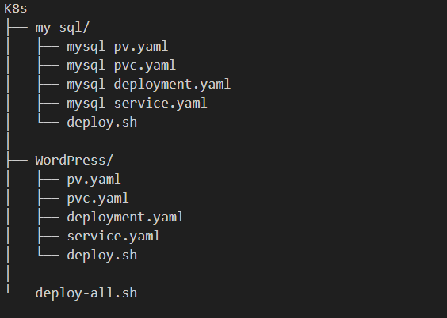
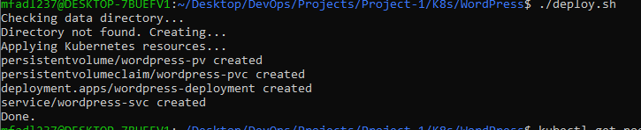
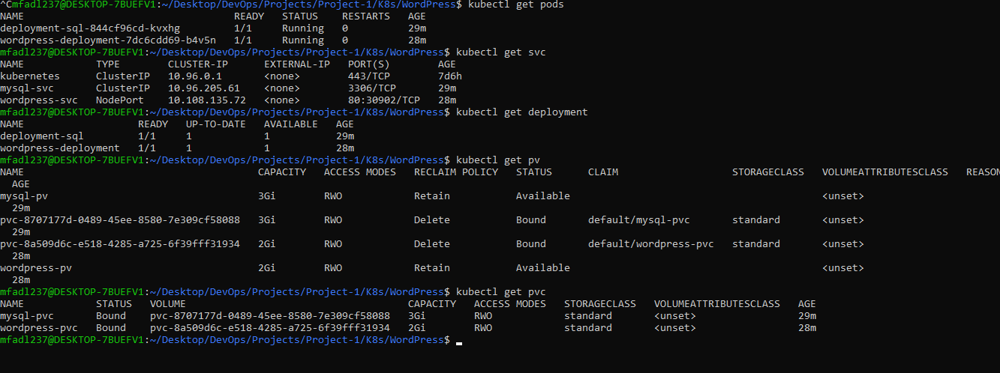
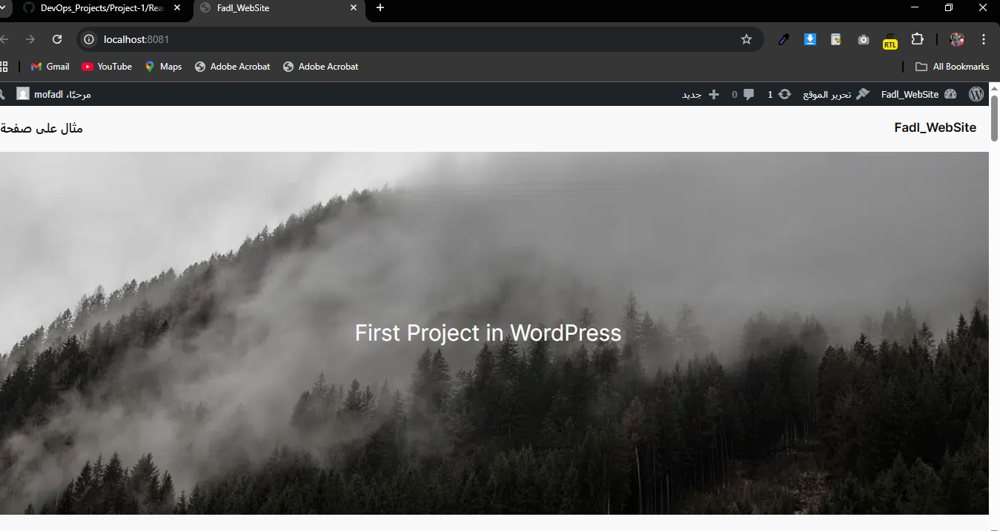

### WordPress + MySQL on Kubernetes

# Overview

This project deploys:

WordPress (Application Layer)

MySQL (Data Layer)

Persistent storage for both services

Secret-based credential injection

Automated bootstrap with dynamic storage paths

Designed for local Kubernetes environments (Minikube / Kubectl).

# Architecture
Client
  ↓
NodePort Service
  ↓
WordPress Pod
  ↓
mysql-svc (ClusterIP)
  ↓
MySQL Pod

Internal service discovery via DNS (mysql-svc)

No hardcoded credentials

No hardcoded storage paths

## Key Design Decisions

# 1. Decoupled Deployments
WordPress and MySQL run in separate Deployments for clean isolation and scalability.

# 2. Persistent Storage

MySQL → /var/lib/mysql

WordPress → /var/www/html

Backed by hostPath PVs for local durability.

# 3. Secure Configuration
Credentials injected via Kubernetes Secrets.
No inline passwords inside manifests.

# 4. Deterministic Initialization
MySQL explicitly initialized with:

MYSQL_DATABASE

MYSQL_USER

MYSQL_PASSWORD

# WordPress explicitly configured with:

WORDPRESS_DB_HOST

WORDPRESS_DB_USER

WORDPRESS_DB_NAME

WORDPRESS_DB_PASSWORD

No reliance on image defaults.

# 5. Automated Bootstrap
A deployment script:

Creates required data directories

Dynamically injects absolute host paths into PV manifests

Applies all Kubernetes resources

Keeps deployment idempotent

No manual path editing required.
## Project Structure

<!-- K8s
├── my-sql/
│   ├── mysql-pv.yaml
│   ├── mysql-pvc.yaml
│   ├── mysql-deployment.yaml
│   ├── mysql-service.yaml
│   └── deploy.sh
│
├── WordPress/
│   ├── pv.yaml
│   ├── pvc.yaml
│   ├── deployment.yaml
│   ├── service.yaml
│   └── deploy.sh
│
└── deploy-all.sh -->
 
## Permision must be Execute
# chmod +x deploy-all.sh

## ./deploy-all.sh

# Pods - Deployment - SVC - PV 

## Run Project Project 
port-forward 8081:80
